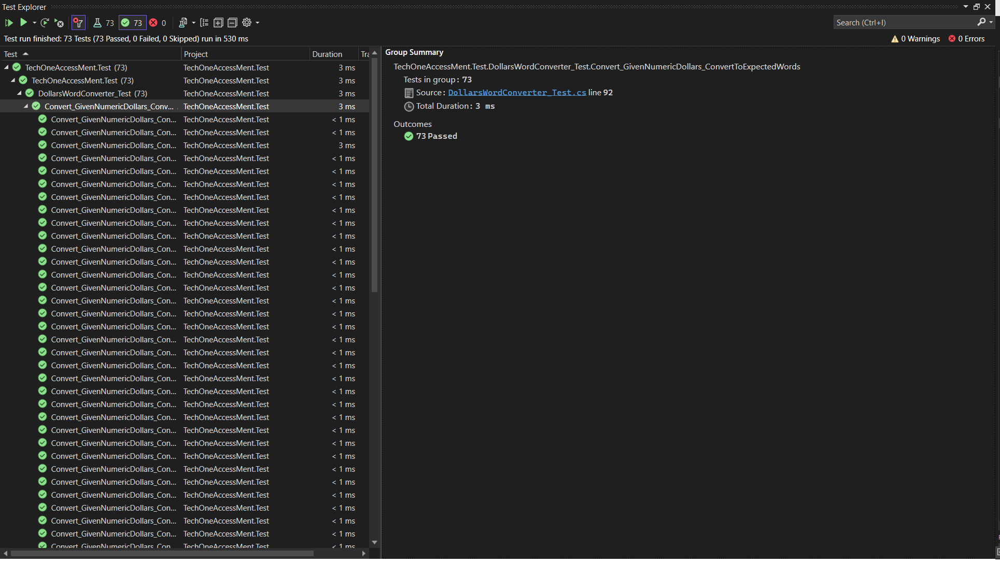

# Technology One Assessment
## How To Build
1. Ensure that your machine has installed required dependencies and tools. Refer to "Prerequisites" section of [Get started with ASP.NET Core MVC](https://learn.microsoft.com/en-us/aspnet/core/tutorials/choose-web-ui?view=aspnetcore-6.0)
2. Clone the repository into your machine
3. Double click "TechOneAssessment.Web.sln" file. It should open the solution with Visual Studio.
4. Right click "TechOneAssessment.Web" inside Visual Sutdio and click on "Build". If it show Build succeeded then it is built succesfully.

## How To Host
1. Create a new App Service (Web App) in Azure
- Select "Code" for publish
- Select ".NET 6" for runtime stack
- Select "Windows" for Operating System
2. Right click "TechOneAssessment.Web" inside Visual Sutdio and click on "Publish".
3. Click "Add a publish profile"
4. Select "Azure" and next.
5. Select "Azure App Service (Windows)" and next.
6. Login and select the App Service you has created justnow and next.
7. The publish profile is created. Click "Publish" to publish.
8. The web is now accessible at your App Service Plan's Default domain.
9. This web can be hosted also in Linux operating system as it is written using .Net 6. 
10. It can also be containerized with Docker, but it will required to add a Dockerfile to build the docker image.

## How To Interact with It
1. The web can be access at "https://techoneaccessment.azurewebsites.net".
2. Enter a number
3. Click on "Convert" button
4. The result will show at the botton of your input

## How to run test
1. Right click "TechOneAssessment.Test" inside Visual Sutdio and click on "Run Tests".
2. Test Explorer will pop out and show the test running status.
3. The tests completed and it will show how many tests are success / fail.

4. Note
- There are only 1 test class in this solution ("DollarsWordConverter_Test")

## Algorithm
1. There are 3 implementations
- DollarsWordConverterV1
  - This is the actual implementation used in the web.
- DollarsWordConverterV2
  - This alogirhtm is similar to DollarsWordConverterV1, but written using iteration approrach (while do loop), instead of recurrsive approach.
  - The difference is more of a programming style or preferrence. Myself prefer using recurrsive approach as it is more readable and easier to understand.
- DollarsWordConverterV3
  - This algorithm allow to convert for very large number, but at the cost of more complex code.
  - Because the input is string data type, parsing is needed and more checking is required to ensure input is correct.
2. Overall, the fundamental algorithm of the three algorithm are identitcal. If it is not required to support large number, i would prefer DollarsWordConverterV1, as DollarsWordConverterV2 and DollarsWordConverterV3's code are more complex and take more time to write.

## Limitation (DollarsWordConverterV1, DollarsWordConverterV2)
1. The algorithm only supports conversion to English. If there is a requirement to support other languages, then the algorithm may or may not be suitable, depending on how different the language is from English
- If it is highly similar, the algorithm  can be refactored to accept a set of objects that define how to convert base on the language.
- Otherwise need to implement another algorithm for that language.

## Enhancement that could be make to improve user experience
1. Format the value in input using "XXX,XXX.00" format. This is much readable when the amount is large.
2. Add a button to paste the amount from clipboard.
3. Instead of showing the latest result, show list of history results, which the latest result on the top.
- Save the results in local storage so that the results is persisted even if user close the tab and come back alter.
- Add a button to each result to allow user to click and copy the word to clipboard directly.
4. Allow to choose currency symbol of different country.
- But some country doesn't have "cents" like Japanese Yen, so might need to programatically allow / disallow 2 decimal.
5. Enhance the appearance of the web UI to make it look more appealing.
* The above enhancement is not implemented due to time constraint.
